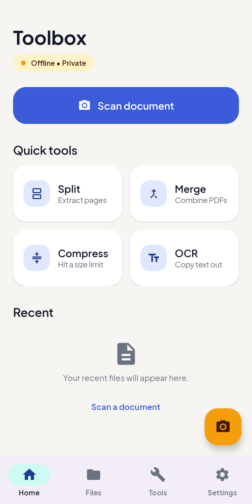
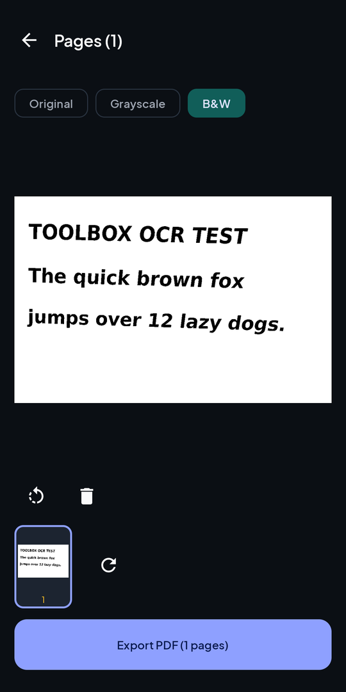
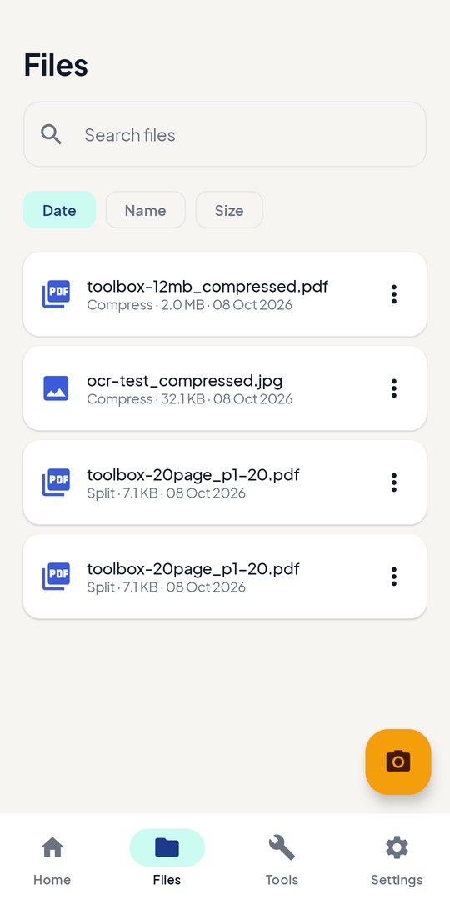
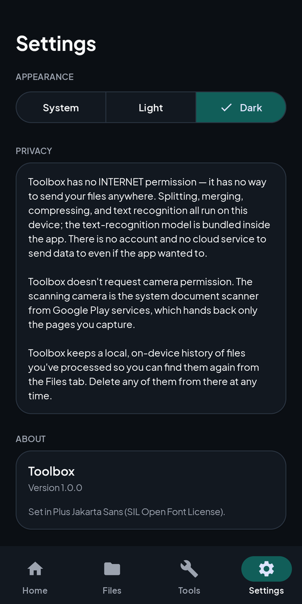

<div align="center">


# Toolbox

**Scan, split, merge, compress and OCR documents — entirely on your phone.**

No account. No upload. No ads. No watermark. No `INTERNET` permission.

[](https://github.com/Tshepomabs16/Toolbox/actions/workflows/ci.yml)


[](LICENSE)

<br />

&nbsp;
&nbsp;
&nbsp;


</div>

---

## Why

Most free scanner and PDF apps upload your documents — IDs, payslips, contracts — to
someone else's server to process them. Toolbox does all of the work on the device, and
it is built so that it **can't** do otherwise: the shipped app has no network permission
at all, and CI fails the build if one ever appears.

## Features

| | Tool | What it does |
|---|---|---|
| 📷 | **Scan** | Capture pages with the system document scanner (edge detection and crop), or import photos. Choose Original, Grayscale or a crisp adaptive **B&W** filter, rotate and remove pages, then export a multi-page PDF. |
| ✂️ | **Split** | Extract pages by range (e.g. `1-3, 7, 10-12`) into a new PDF. |
| 🔗 | **Merge** | Combine several PDFs into one, in the order you choose. |
| 🗜️ | **Compress** | Shrink a PDF or image to a target size — 1, 2 or 5 MB, or a custom limit — for upload portals with a size cap. Never returns a file bigger than the original. |
| 🔤 | **OCR** | Recognise text in an image and copy it out. The recognition model is bundled in the app, so it works offline. |
| 🗂️ | **Files** | Every result is kept in an on-device history you can search, sort, open, share, save anywhere or delete. |

Also: light, dark and system themes; results keep sensible file names
(`Scan 2026-10-08 16.24.pdf`, `report_p1-3.pdf`) when you share or save them.

## Privacy by construction

- **No `INTERNET` permission.** ML Kit and Play services pull it in transitively, so the
  manifest strips it with `tools:node="remove"`.
  [`scripts/check-no-internet.sh`](scripts/check-no-internet.sh) runs in CI and fails if
  the strip directive is removed, if any merged manifest grants the permission, or if no
  release manifest exists to check — a guardrail that can't fail would be worse than none.
- **No camera permission.** Scanning uses the Google Play services document scanner,
  which runs in its own process and hands back only the pages you capture.
- **No analytics, crash reporting or remote config.** History lives in a local Room
  database and backups are disabled.
- Files are shared to other apps through a non-exported `FileProvider`, one URI grant at a time.

See [PRIVACY.md](PRIVACY.md) for the full policy.

## Built with

- **Kotlin** and **Jetpack Compose** with **Material 3**
- **ML Kit** — Document Scanner and bundled Text Recognition v2
- **PdfBox-Android** — split, merge and PDF compression
- **Room** (history), **DataStore** (preferences), **Navigation Compose**

### Engineering notes

- **Memory-safe scanning.** Pages are held as small thumbnails; full-resolution bitmaps
  are decoded one at a time while the PDF is streamed out. A 25-page scan of 12 MP photos
  peaks at about 200 MB instead of 550 MB and exports in under 3 seconds on a Galaxy A15.
- **Fast B&W filter.** The adaptive threshold uses a summed-area table, so each pixel costs
  O(1) regardless of window size. Instrumented tests pin it pixel-for-pixel to the original
  naive implementation.
- **Swappable PDF engine.** Tools talk to a small `PdfEngine` interface; PdfBox is one
  implementation behind it.

## Project structure

```
app/src/main/kotlin/com/mabsSD/toolbox/
├── pdf/        PdfEngine interface, PdfBox implementation, compressor, page ranges
├── ocr/        On-device text recognition
├── tools/      One class per tool, plus the registry, runner and result store
├── history/    Room database of processed files
├── settings/   DataStore preferences (theme, onboarding)
├── utils/      Image filters, PDF export, file management
└── ui/         Compose screens, components and theme
```

## Building

Requires **JDK 17–21** (AGP 8.7 rejects newer JDKs with an unhelpful
`What went wrong: 25.0.3`). Android Studio's bundled JDK works.

```bash
git clone https://github.com/Tshepomabs16/Toolbox.git
cd Toolbox
./gradlew assembleDebug          # app/build/outputs/apk/debug/app-debug.apk
```

```bash
./gradlew testDebugUnitTest          # JVM unit tests
./gradlew connectedDebugAndroidTest  # instrumented tests (device or emulator)
./gradlew assembleRelease && ./scripts/check-no-internet.sh   # verify the hard rule
```

Scanning needs a device with Google Play services.

## Roadmap

- [ ] Open PDFs and images shared to Toolbox from other apps (the share-sheet entry is declared but not yet handled)
- [ ] Searchable PDFs — add an OCR text layer to scans
- [ ] Reorder pages in the scan review
- [ ] Documents → PDF, sign and password-protect PDFs, QR scan and generate, batch mode

## License

[MIT](LICENSE) © 2026 Tshepo Maabane.
Plus Jakarta Sans is used under the [SIL Open Font License](licenses/OFL-PlusJakartaSans.txt).
